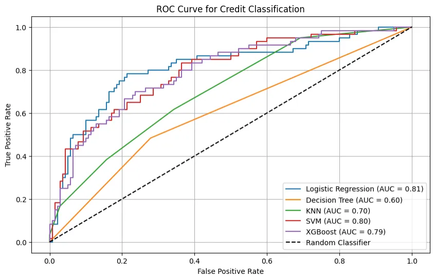
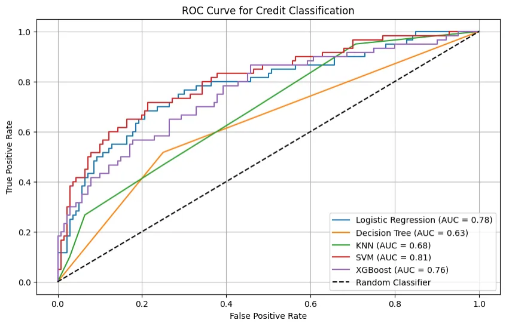

# README 

This is my personal GitHub Repository for CIND 820 Big Data Analytics the capstone project for Data Analytics, Big Data, and Predictive Analytics certificate by The Chang School of Continuing Education.  

**Table of Contents** 

- [Project Overview](#project-overview)
- [IDE](#ide)
- [German Credit Dataset](#german-credit-dataset)
- [Classification Models](#classification-models)
- [Evaluation](#evaluation)

### Project Overview

This is a comparison study of binary classification machine learning models. The German Credit Data dataset will be used to train and test various binary classification models.  Upon completing of this study the goal  is to replicate the findings of academic peers that XGBoost offer the best binary classification performance measured by ROC AUC. 

### IDE

#### Google Colab

Google Colab is the primary IDE used by this study

Google Colab (short for Colaboratory) lets users write and execute Python code in a web browser, with free access to GPUs and easy sharing of notebooks. It’s widely used for prototyping, collaborating, and learning, especially in fields like data analytics and AI.

[Google Colab](https://colab.google/) is the IDE selected to complete this project.

#### Environment Notes

_File Importing_

Required files are saved locally and uploaded using upload.() to Google Colab - should you wish to run this Python Notebook locally you will need to edit the import to support your personal development enviroment. 

_Required Libraries_ 

This study relies heavily on [scikit-learn](https://scikit-learn.org/stable/) but also uses several other established Python libraries. 

See [PythonLibraries](PythonLibraries.ipynb) for a comprehsive list of libraries used. 

### German Credit Dataset 

_Raw Dataset_

The German Credit Dataset is publically accessible from [UC Irvine Machine Learning Repository](https://archive.ics.uci.edu/dataset/144/statlog+german+credit+data) and in this github repository. 

The raw dataset consists of 1,000 observed instances classifing individuals as having good or bad credit. A strong imbalance is a prevailing characteristic as majority of instances have good credit in this dataset. Each instance is comprised of 20 attributes split between 4 numeric and 16 categorical. Evidently the raw dataset does not possess any missing values, but this study determined transformation, scaling, and sampling will be required prior to testing various classification models.

_Metadata_

JSON file created to provide metadata to the German Credit Dataset

### Classification Models 

The below classification models are trained and tested in this project. 

Click on any of the models to be guided to externally hosted model documentation. 

- [Logistic Regression](https://scikit-learn.org/stable/modules/generated/sklearn.linear_model.LogisticRegression.html#sklearn.linear_model.LogisticRegression)
- [Decision Trees](https://scikit-learn.org/stable/modules/generated/sklearn.tree.DecisionTreeClassifier.html#sklearn.tree.DecisionTreeClassifier)
- [K Nearest-Neighbors](https://scikit-learn.org/stable/modules/generated/sklearn.neighbors.KNeighborsClassifier.html#sklearn.neighbors.KNeighborsClassifier)
- [Support Vector Machine](https://scikit-learn.org/stable/modules/generated/sklearn.svm.SVC.html#sklearn.svm.SVC)
- [XGBoost](https://xgboost.readthedocs.io/en/stable/python/python_intro.html)

### Evaluation

This study will evaluate models numerically and visually with core performance metrics and plots respectively. 

Each model was trained and tested using functions such as `log_reg_pred()`, `decision_tree_pred()`, `knn_pred()`, `svm_pred()`, and `xgboost_pred()`.

Core performance metrics are computed using the function `core_metrics.()` which calculates _accuracy_, _precision_, _recall_, _F1_, and _specificity_. These core metrics provide a balanced view, especially for imbalanced data where accuracy alone can be misleading—precision and recall emphasize performance on the minority class (bad credit), while F1 balances them. Confusion matrices are plotted using `plot_cm.()` function to visualize true positives, true negatives, false positives, and false negatives, offering insights into error types (e.g., Type I vs. Type II errors critical in credit risk). Comparative ROC AUC is plotted using `plot_roc_curve.()` function, which computes false positive rates, true positive rates, and AUC for each model, aggregating results in a single figure for visual comparison. 

See Initial_Results_V5 for full initial binary classification machine learning models. 

The initial results, summarized in tabular format below, show that the Support Vector Machine (SVM) achieved the highest accuracy (0.7550) and specificity (0.8143), while XGBoost demonstrated balanced performance across metrics.

_Initial Results Table_

| Model             | Accuracy | Precision | Recall | F1     | Specificity |
|-------------------|----------|-----------|--------|--------|-------------|
| Logistic Regression | 0.7350 | 0.5507 | 0.6333 | 0.5891 | 0.7786 |
| Decision Tree     | 0.5950 | 0.3750 | 0.4833 | 0.4444 | 0.6214 |
| KNN               | 0.6550 | 0.4286 | 0.4500 | 0.4390 | 0.7429 |
| SVM               | **0.7550** | **0.5873** | **0.6167** | **0.6016** | **0.8143** |
| XGBoost           | 0.7300 | 0.5517 | 0.5333 | 0.5424 | 0.8143 |

_ROC AUC Imbalanced_ 

_ROC AUC Balanced_
